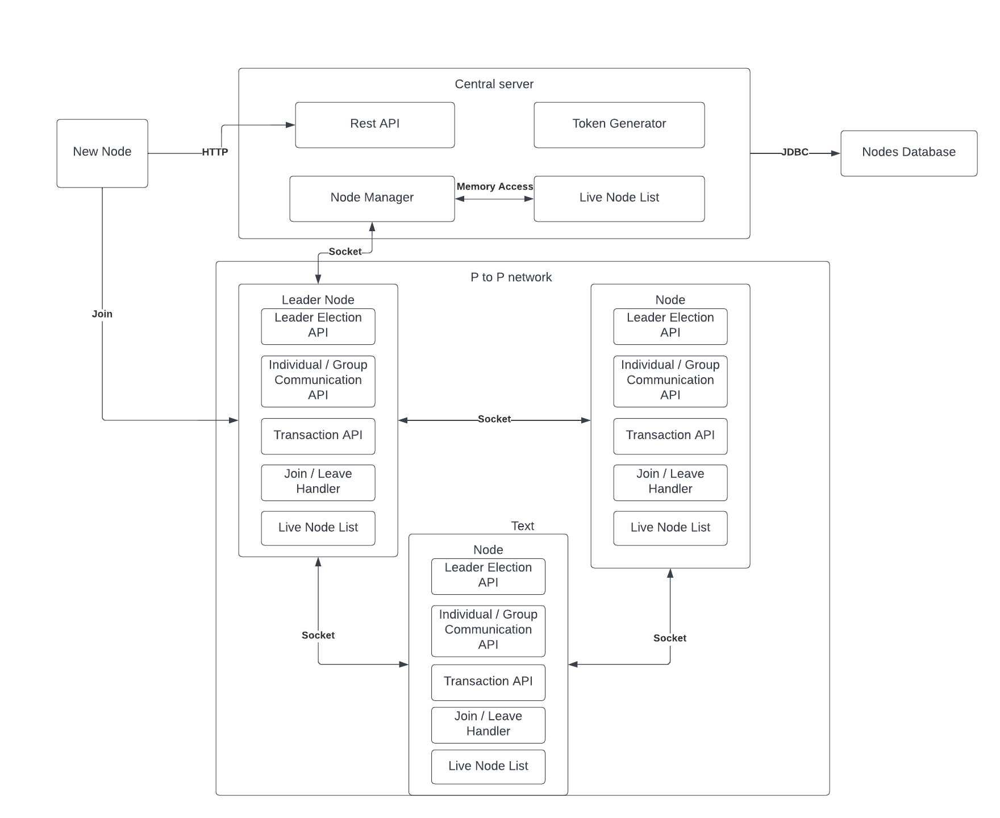
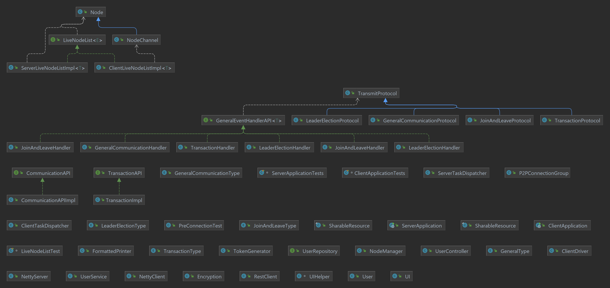

# MultiAgent Chat

### Team members: 
Zhicun Chen, Vijaya Teja Rayavarapu

## Objective:
For the final project, we have developed a multi-agent chat system that relies on a
peer-to-peer network setup. The central server is first spun up and then each user i.e.
client can sign up, log in and connect to the central server and log out as well. Once
connected to the central server, the users can communicate with other users in the
network. This project is appropriate for everyday usage and allows users to converse
remotely within a group. As a part of this project, we were able to implement and gain a
deeper understanding of some of the important concepts taught in class.

## Concepts Implemented:
We implemented the following concepts taught in class for this project:
- 1.) Distributed mutual exclusion
- 2.) Distributed transactions
- 3.) Group communications
- 4.) Peer-to-peer networks
- 5.) Fault tolerance.

#### Distributed mutual exclusion: 
The central server has the algorithm implemented for
giving a token to the lead node. Only the token-holding node may establish a long
polling connection with the central server. This technique used to choose the lead node
also prevents race conditions with the central server.

#### Distributed transactions: 
We have used 2 phase commits for maintaining node
information in our application. Whenever a new node joins or leaves the P-to-P network,
two-phase commits guarantee that all nodes and the central server have the same live
node lists. This use of distributed transactions ensures the consistency of the nodes.

#### Group communication: 
This program also makes use of group communication since if
someone in a group network wants to join or publish something, they first interact with
one another.

#### Peer to Peer Network: 
We employed a peer-to-peer network using sockets for each
client (node) to interact, update the program's state, and pick the leader node.
Fault-tolerant: The leader election API and transaction API ensure that our chat system
is fault-tolerant. They ensure that if one communication node fails, the other nodes may
readily update the status and synchronize data. As a result, our software is fairly faults
tolerant.

## Architecture:
Assumptions:
1. No Byzantine problem.
2. Central server will never crash.
3. Node will not crash during a leader election or transaction processing besides these it
   can crash anytime.
4. No malformed message in the system, because when the application starts users
   have to log in or signup so that we can ensure their identity. An application with
   malformed messages will not be allowed to join the system.
5. Leader election will access the CPU and memory to get a load, if the program doesn’t
   have privileges to grab from your operating system, then use a default value for those.
   This will not crash the system.

### System overview:


## Design:
### UML Overview:


### Frameworks in use:
* Netty -> construct the peer to peer connection
* Spring boot & maven -> manage dependencies and package modules, application starter
* Spring Web -> rest api and rest template are used for signup, login, and logout
* Spring Data Jpa -> data access layer

### Database:
* Amazon RDS


## How to run:
```` java
// go to the directory res
cd res

// run the server with p2p port, note http server will run on 9000, don't use the same port, pre-connection tester will notify you if not available
java -jar server.jar <p2p port>
// example
java -jar server.jar 9001

// run the client with client port, server hostname, server http port, server p2p port
java -jar client.jar <client port> <server hostname> <server http port> <server p2p port>
// example
java -jar client.jar 9002 localhost 9000 9001    
````
